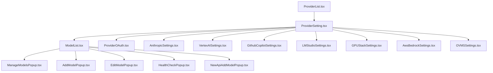
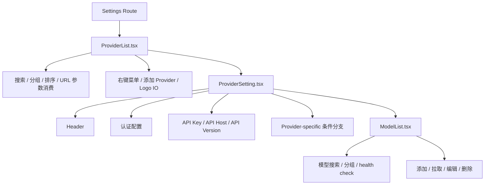
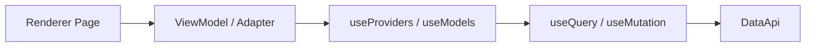
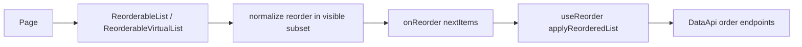
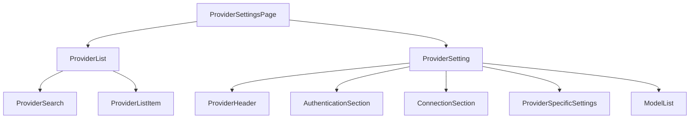
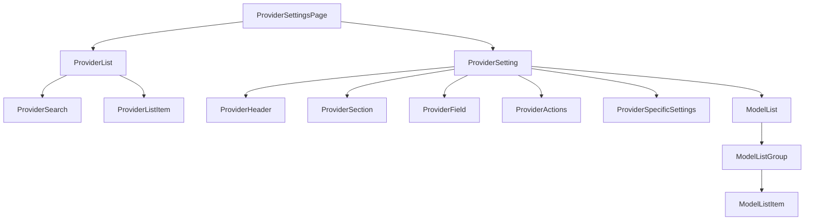
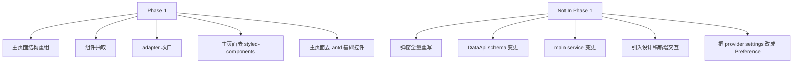

# Provider Settings / Model List v2 UI 重构方案
## Phase 1: Main Pages

> 基准：以当前仓库现有逻辑与交互为准  
> 参考：`E:\code\Cherry Studio UI Design 2\cherry-studio-ui-design`  
> 范围：`ProviderList` / `ProviderSetting` / `ModelList` 主页面  
> 暂不纳入第一阶段：`Add/Edit/Manage/HealthCheck` 等弹窗全家桶整体重写

---

## 1. 方案摘要

本次方案的目标不是“照搬设计稿页面”，而是基于现有 Cherry Studio 仓库的真实数据边界和现有交互，做一轮 **符合 v2 规范的 UI 重构与组件抽取**。

核心目标：

- 保持现有功能和交互语义不变
- 保持 DataApi 契约不变
- 将主页面中的大组件拆解为稳定的 v2 组件体系
- 将 legacy / v1 兼容逻辑收口到 adapter / side-effects 层
- 主页面先完成去 `styled-components` / 去主干 `antd` 控件依赖
- 为第二阶段弹窗体系重构打下稳定接口基础

---

## 2. 现状判断

当前这一块并不是单一页面，而是一整个组件家族：



### 当前问题分布

#### 2.1 页面层问题

- `ProviderSetting.tsx` 体量过大，承担了：
  - 数据获取
  - 草稿态管理
  - provider 条件分支
  - legacy 兼容写法
  - UI 拼装
- `ProviderList.tsx` 混合了：
  - 路由 search 参数消费
  - provider 列表展示
  - logo IO
  - URL schema 导入
  - 右键菜单行为
  - 排序逻辑

#### 2.2 UI 技术栈问题

- 主页面仍然大量混用：
  - `antd`
  - `styled-components`
  - `@cherrystudio/ui`
- 这和仓库 v2 方向不一致：
  - UI 应优先收敛到 `@cherrystudio/ui` + Tailwind
  - 页面结构层不应继续扩散 `antd` 和 `styled-components`

#### 2.3 逻辑分层问题

存在多处不应继续留在展示组件内部的兼容逻辑：

- `checkApi` 仍依赖 v1 shim
- zhipu 的 websearch provider 同步写入仍在 UI 中
- copilot 仍有 dual-write 兼容逻辑
- OVMS 能力检测在页面层直接用 `useSWRImmutable`
- logo 读写行为直接掺在 sidebar 主流程里

### 2.4 旧组件布局架构

当前主页面的布局架构，本质上是“列表页 + 详情页 + 模型区”三层，但实现上没有真正分层，而是通过大组件内联拼装完成：



旧布局架构的问题不是“层级少”，而是“职责压扁”：

- `ProviderList.tsx` 同时承担页面壳、侧边栏、路由参数消费、provider 导入、排序与菜单动作
- `ProviderSetting.tsx` 同时承担详情页容器、字段编辑表单、兼容 side-effects、provider-specific 分支挂载
- `ModelList.tsx` 既是模型区 section，又直接持有多种动作入口和部分弹窗协作逻辑

也就是说，旧架构在视觉上是左右布局，在代码上却更接近：

```text
一个大侧栏组件
  + 一个大详情组件
    + 一个大模型组件
      + 多个弹窗入口
      + 多个兼容逻辑入口
```

这导致：

- 布局组件无法复用
- section 无法独立替换
- provider-specific 面板只能继续挂在条件分支里扩张
- 想做 UI 重构时，必须先穿透业务逻辑和兼容逻辑

---

## 3. v2 规范下的边界判断

### 3.1 数据边界

这块数据仍应严格保持为 **DataApi 业务数据**：

- Provider 业务数据：DataApi
- Model 业务数据：DataApi

不应迁移为 Preference / Cache 的内容：

- `apiHost`
- `anthropicApiHost`
- `apiVersion`
- `localApiKey`
- 模型搜索词
- 当前 host selector

原因：

- 这些是页面编辑草稿态，不是跨窗口偏好
- 也不是需要持久化的 UI 缓存
- 更不应该进入 Redux

### 3.2 v2 分层建议



约束：

- 页面组件只关心展示和交互拼装
- ViewModel 层负责派生状态和事件封装
- 兼容逻辑进入 adapter / side-effects 层
- 不新增 Redux 依赖
- 不修改现有 main service / DataApi schema

---

## 4. 参考设计稿后可落地借鉴的部分

设计稿仓库里最值得借鉴的不是完整页面实现，而是 **结构组织方式**。

### 可以借鉴

- 左侧 provider 导航 + 右侧 detail panel
- detail 区域按 section card 分段
- model list 标题栏的计数 / 搜索 / action 组合
- provider list 中 enabled / disabled 分组表现
- model picker / model management 的结构型组件思路

### 不采用

- 设计稿里的新增 provider setting 交互
- endpoint tabs 的新增产品语义
- key management / model management 抽屉化新流程
- 任何超出现有行为基准的新产品决策

一句话概括：

> 借鉴“页面结构和组件颗粒度”，不借鉴“新交互定义”。

---

## 5. 第一阶段重构范围

### 纳入第一阶段

- `ProviderList`
- `ProviderSetting`
- `ModelList`

### 只定义接入边界，不在第一阶段整体重写

- `AddProviderPopup`
- `EditModelPopup`
- `ManageModelsPopup`
- `HealthCheckPopup`
- `SelectProviderModelPopup`
- `NewApiAddModelPopup`
- `NewApiBatchAddModelPopup`

其中 `ManageModelsPopup` 在第一阶段的定位是：

- 继续作为 `ModelList` 的既有弹窗存在
- 由 `ModelList` 的“拉取 / 管理模型”动作触发
- 不并入本次公共拖拽排序组件抽象
- 不在本阶段重命名

---

## 6. 通用拖拽排序能力

### 6.1 目标

这次不是新增一套排序算法，而是把现有分散的 draggable / reorder UI 能力收敛成统一入口。

统一目标：

- 数据层继续复用现有 `useReorder`
- UI 层把多个拖拽组件和重排适配逻辑收成统一用法
- 之后各页面只记一种拖拽排序接入方式
- 对简单列表和虚拟列表保持同一套事件语义

### 6.2 现有盘点

当前仓库里与拖拽排序直接相关的 UI 能力主要分散在这几套实现：

- `DraggableList`
- `DraggableVirtualList`
- `Sortable`
- `useDraggableReorder`
- `useDndReorder`

它们的职责重叠点主要有两类：

- 拖拽渲染容器重复
- 过滤后列表与原始列表的索引映射逻辑重复

其中数据层其实已经统一：

- `useReorder(collectionUrl)`

因此问题不在排序协议，而在 UI 入口没有统一。

### 6.3 最终组件设计

建议收敛为三层：

- 数据同步入口：`useReorder`
- 普通列表入口：`ReorderableList`
- 虚拟列表入口：`ReorderableVirtualList`

整体关系如下：



这套设计的关键点不是统一拖拽库，而是统一页面层契约：

- 页面只接收 `nextItems`
- 页面不感知 `oldIndex/newIndex`
- 页面不感知过滤列表到原始列表的映射细节
- 页面不感知底层用的是 `dnd-kit` 还是 `@hello-pangea/dnd`

### 6.4 公共 API

#### `ReorderableList`

适用于：

- 普通纵向列表
- 横向列表
- 网格排序
- 不需要虚拟滚动的设置页与管理页

```ts
type ReorderableListProps<T> = {
  items: T[]
  visibleItems?: T[]
  getId: (item: T) => string
  renderItem: (item: T, state: { dragging: boolean }) => React.ReactNode
  onReorder: (nextItems: T[]) => void | Promise<void>
  layout?: 'list' | 'grid'
  direction?: 'vertical' | 'horizontal'
  disabled?: boolean
  className?: string
  gap?: number | string
  onDragStateChange?: (dragging: boolean) => void
}
```

约定：

- `items` 是原始完整列表
- `visibleItems` 是当前界面渲染子集；未传时默认等于 `items`
- 拖拽结束后组件内部负责把“可见列表重排”映射回完整列表，然后回调 `onReorder(nextItems)`

#### `ReorderableVirtualList`

适用于：

- `ProviderList`
- `Topics`
- `Sessions`
- `Agents`
- 其它需要虚拟滚动的长列表

```ts
type ReorderableVirtualListProps<T> = {
  items: T[]
  visibleItems?: T[]
  getId: (item: T) => string
  renderItem: (item: T, index: number, state: { dragging: boolean }) => React.ReactNode
  onReorder: (nextItems: T[]) => void | Promise<void>
  estimateSize: (index: number) => number
  overscan?: number
  disabled?: boolean
  className?: string
  scrollerStyle?: React.CSSProperties
  itemContainerStyle?: React.CSSProperties
  onDragStateChange?: (dragging: boolean) => void
  ref?: React.Ref<ReorderableVirtualListRef>
}
```

两者必须保持同一组核心语义：

- `items`
- `visibleItems`
- `getId`
- `renderItem`
- `onReorder`
- `disabled`

这保证页面在“普通列表”和“虚拟列表”之间迁移时，不需要重新学习另一套接口。

### 6.5 内部抽象

公共组件内部建议拆成：

- `reorderVisibleSubset`
  - 纯函数
  - 负责把可见子集拖拽结果映射回完整列表
- `useReorderableState`
  - 统一 drag state、active item、禁用态、事件包装
- `ReorderableList`
  - 普通列表入口
- `ReorderableVirtualList`
  - 虚拟列表入口

纯函数签名建议：

```ts
function reorderVisibleSubset<T>(params: {
  items: T[]
  visibleItems: T[]
  fromIndex: number
  toIndex: number
  getId: (item: T) => string
}): T[]
```

这个纯函数是整套统一能力的核心，因为当前重复的 `useDraggableReorder` / `useDndReorder` 本质都在做这件事。

### 6.6 分层与落位

建议分层如下：

- `packages/ui`
  - 保留底层通用拖拽实现
  - 不感知 DataApi
  - 不感知 Cherry Studio 的业务数据结构
- `src/renderer/src/components/reorderable/`
  - 暴露 `ReorderableList`
  - 暴露 `ReorderableVirtualList`
  - 暴露 `reorderVisibleSubset`
  - 暴露必要类型
- `src/renderer/src/data/hooks/useReorder.ts`
  - 继续负责 optimistic reorder 与服务端同步

这样做的原因：

- UI 基础库继续保持通用
- 应用层把“过滤子集重排 + 统一页面契约”封装掉
- DataApi 同步逻辑不回流到 UI 组件内部

### 6.7 使用方式

页面层的标准用法应收敛成：

```tsx
const { data } = useQuery('/providers')
const providers = data ?? []
const visibleProviders = filterProviders(providers, searchText)
const { applyReorderedList } = useReorder('/providers')

return (
  <ReorderableVirtualList
    items={providers}
    visibleItems={visibleProviders}
    getId={(item) => item.id}
    estimateSize={() => 40}
    onReorder={applyReorderedList}
    renderItem={(item) => <ProviderListItem provider={item} />}
  />
)
```

页面层不再：

- 手写 `onDragEnd`
- 手写 `oldIndex/newIndex` 映射
- 手写 filtered/original list index 对齐
- 直接依赖具体拖拽库事件对象

### 6.8 与现有实现的关系

收敛方向不是“再做第 5 个组件”，而是：

- 用 `ReorderableList` 替代 `DraggableList`
- 用 `ReorderableVirtualList` 替代 `DraggableVirtualList`
- 把 `Sortable` 收敛到内部实现层
- 删除 `useDraggableReorder`
- 删除 `useDndReorder`

允许的过渡态：

- 普通列表继续内部走 `Sortable`
- 虚拟列表继续内部走 `@hello-pangea/dnd`

但这两个差异不能再暴露给页面层。

### 6.9 代码质量要求

公共组件必须满足：

- 无业务数据依赖
- 无 DataApi 依赖
- 无本地镜像状态覆盖服务端列表
- 不暴露第三方拖拽库事件类型到页面层
- 纯函数负责重排映射，组件不手写重复逻辑
- 普通列表和虚拟列表共享同一套核心语义
- 支持 filtered view reorder
- 支持 `disabled`
- 支持稳定 `getId`

同时遵守 React 侧的简化原则：

- 不引入额外 `Controller` / `Manager` / `ViewModel`
- 不在组件外要求页面维护拖拽中间态
- 不让调用方决定使用哪套拖拽库

### 6.10 测试要求

必须覆盖：

- 未过滤列表的拖拽重排
- 过滤后列表的拖拽重排
- `fromIndex === toIndex` 时不回调
- `disabled` 时不可拖拽
- 普通列表与虚拟列表产出同样的 `nextItems`
- `useReorder(...).applyReorderedList` 接入后能正确更新 DataApi 集合

### 6.11 页面迁移顺序

优先迁移顺序：

1. `ProviderList`
2. `McpServersList`
3. `TabContainer`
4. `Topics`
5. `Sessions`
6. `Agents`
7. 其余简单列表页面

原因：

- 这些页面最能覆盖“过滤列表 + 虚拟列表 + 横向排序 + DataApi 重排”的主要场景

### 6.12 命名定稿

拖拽排序相关的最终命名统一为：

- 数据层：`useReorder`
- 普通列表组件：`ReorderableList`
- 虚拟列表组件：`ReorderableVirtualList`
- 纯函数：`reorderVisibleSubset`
- 类型：
  - `ReorderableListProps`
  - `ReorderableVirtualListProps`
  - `ReorderableVirtualListRef`

不继续扩散：

- `useDraggableReorder`
- `useDndReorder`
- `DraggableList`
- `DraggableVirtualList`
- `Sortable`

---

## 7. 重构后的主页面结构



### 7.1 新组件布局架构

重构后的布局架构，要从“页面里堆组件”改成“壳层 -> 区块层 -> 行级组件层 -> adapter 层”的稳定结构。

#### 新布局总览



#### 新布局的分层含义

**第一层：页面壳层**

- `ProviderSettingsPage`
- `ProviderList`
- `ProviderSetting`

这一层只决定页面结构、左右布局、选中态切换和区块编排，不直接处理底层兼容逻辑。

**第二层：区块层**

- `ProviderHeader`
- `ProviderSection`
- `ModelList`
- `ModelListGroup`

这一层负责“一个区域怎么摆”，而不是“数据怎么改”。

**第三层：行级组件层**

- `ProviderField`
- `ProviderActions`
- `ProviderListItem`
- `ModelListItem`

这一层负责统一字段布局、按钮布局、单行展示样式，确保页面重构后视觉和交互结构稳定。

**第四层：适配与派生层**

- `useProviderSetting`
- `providerCheckApiAdapter`
- `providerSettingsSideEffects`
- `providerSidebarAdapter`

这一层把 legacy 兼容、副作用、v1 shim、logo IO、URL schema 导入等逻辑从布局组件里抽走。

#### 新老布局架构对比

| 维度 | 旧布局架构 | 新布局架构 |
|---|---|---|
| 页面组织 | `ProviderList -> ProviderSetting -> ModelList` 串联 | `Page -> ProviderList / ProviderSetting -> Section / Item` 分层 |
| 布局职责 | 布局与业务逻辑混在大组件里 | 布局组件只关心结构与编排 |
| 字段区 | API Key / Host / Version 直接散落在详情组件 | 收敛为 `ProviderField` + `ProviderActions` |
| 模型区 | 模型标题、搜索、分组、动作混在 `ModelList` | 收敛为 `ModelList -> ModelListGroup -> ModelListItem` |
| 特殊 provider 面板 | 条件分支直接写在详情组件内部 | 统一挂到 `ProviderSpecificSettings` |
| 兼容逻辑 | 散落在 `ProviderList` / `ProviderSetting` | 收敛到 adapter / side-effects |
| 后续扩展 | 新增一个分支就继续膨胀大文件 | 新增 section 或 item 即可挂载 |

#### 迁移后的布局收益

- 页面骨架稳定，后续视觉调整不需要改业务逻辑
- 区块与行级组件可复用到其它 settings 页
- provider-specific 面板不再继续污染主详情组件
- 第二阶段重构 popup 时，不需要重新拆主页面布局
- 更符合 v2 中“DataApi 在数据层，UI 在结构层，兼容逻辑在 adapter 层”的约束

### 7.2 组件命名标准与定稿

这一块的命名不建议只按“听起来顺”来定，而应该按组件在页面树中的职责来定。这里采用的原则是：

- 严格遵守官方保留语义
- 最大限度继承已有稳定命名
- 只重命名明显不合理的名字
- 名字只表达一个核心职责
- 只在一级主组件上保留少量上下文

#### 命名标准

**1. `Page` 只留给路由叶子页面**

- 只有真正和路由一一对应的组件使用 `*Page`
- 不把普通布局组件或页面内部组合组件命名成 `Page`

**2. `Layout` 只留给共享布局包装层**

- 只有当组件承担“包裹多个子页面或子路由”的共享布局职责时，使用 `*Layout`
- 页面内部的双栏结构，不必额外引入 `Shell`

**3. 页面内部结构直接用语义名，不引入 `Shell`**

- 一级主组件沿用旧名：`ProviderList`、`ProviderSetting`、`ModelList`
- 一级子区块补足少量上下文：`ProviderHeader`、`ProviderField`、`ProviderActions`
- 已有含义稳定的旧名字优先保留，不重新发明新词

在 `ProviderSettings/` 目录里，这套命名已经足够清楚。

**4. `ProviderList` / `ProviderSetting` / `Section` 按可视层级使用**

- `ProviderList`: 当前页面左侧 provider 列表区
- `ProviderSetting`: 当前页面右侧 provider 详情主面板
- `Section`: 面板内部的语义区块

不要混用：

- 左侧导航不用叫 `Panel`
- 表单字段区不用叫 `Container`
- 单个区块不要随意叫 `Module`

**5. 集合用 `List` / `Item`，表单用 `Field`**

- 可遍历集合：`List`
- 集合中的单个元素：`Item`
- 单个字段单元：`Field`
- 仅当组件天然表现为一行时再使用 `Row`

**6. `Slot` 只用于真正的扩展插槽**

- 只有当父组件通过 `children`、render prop、组件注入等方式把内容塞进去时，才使用 `Slot`
- 如果只是一个内部按条件渲染的区块，不应叫 `Slot`

**7. Hook 用 `use*`，避免引入 MVVM / Controller 黑话**

- React 生态中 `useXxx` 是最稳定共识
- 若一个 hook 同时管理草稿态、提交动作、派生状态，优先贴近主组件命名
- 只有当同一目录下存在多个同名 hook 时，再增加后缀

**8. 文件名与主导出标识一致**

- 一个组件一个主文件
- 文件名直接反映主导出组件名
- 避免 `helpers.ts`、`common.tsx`、`wrapper.tsx` 这类泛化命名

#### 第一阶段推荐落地命名

如果这轮方案要进入实现，建议直接按下面这套命名落地：

- `ProviderSettingsPage`
- `ProviderList`
- `ProviderListItem`
- `ProviderSetting`
- `ProviderHeader`
- `AuthenticationSection`
- `ConnectionSection`
- `ProviderField`
- `ProviderActions`
- `ProviderSpecificSettings`
- `ModelList`
- `ModelListGroup`
- `ModelListItem`
- `useProviderSetting`

#### 不建议继续扩散的命名

- `Container`
- `Wrapper`
- `Common`
- `Helper`
- `Manager`
- `Module`
- `Shell`
- `Controller`
- `ViewModel`
- `Slot`

这些命名的问题不是“绝对错误”，而是：

- 无法表达页面树层级
- 难以区分结构组件和逻辑组件
- 在多人协作里容易快速失去语义边界

---

## 8. 建议抽取的组件

### 7.1 页面骨架组件

#### `ProviderSettingsPage`

职责：

- 路由叶子页面入口
- 负责从 route 层进入 provider settings 页面
- 负责挂载 `ProviderList` 和 `ProviderSetting`
- 承担当前页面的左右分栏布局
- onboarding / normal 模式差异
- URL search 参数与选中 provider 绑定
- 空态和默认选中逻辑

#### `ProviderList`

职责：

- provider 搜索
- enabled / disabled 分组
- 列表滚动
- 拖拽排序
- 添加 provider 入口
- 右键菜单入口

#### `ProviderSetting`

职责：

- 单个 provider 的 detail 容器
- section 级编排
- 组合具体区块，不承载底层兼容细节

### 7.2 通用展示组件

#### `ProviderListItem`

- 单行 provider 渲染
- 包括：
  - logo
  - 名称
  - 选中态
  - 拖拽 handle
  - 辅助状态

#### `ProviderHeader`

- provider 名称
- 官网链接
- API options 按钮
- enable switch

#### `ProviderSection`

统一 section 容器：

- 标题
- 辅助说明
- 右侧 action
- section body

#### `ProviderField`

统一字段行布局，覆盖：

- API Key
- API Host
- Anthropic Host
- API Version

#### `ProviderActions`

统一动作区：

- 检查连接
- 打开 key list
- reset
- custom header
- 批量入口

### 7.3 模型区组件

#### `ModelList`

- 模型区标题
- 模型计数
- 搜索
- health check
- 拉取模型
- 添加模型
- 打开 `ManageModelsPopup`

#### `ModelListGroup`

- 分组标题
- 折叠行为
- 组级删除动作
- 虚拟列表容器

#### `ModelListItem`

- logo
- 模型名 / identifier
- tags / capabilities
- 健康状态
- 编辑 / 删除按钮

#### 既有弹窗保留关系

- `ModelList` -> 打开 `ManageModelsPopup`
- `ManageModelsPopup` -> 继续承载远端模型拉取、筛选、批量添加/移除
- `ModelListGroup` / `ModelListItem` 不直接承载“拉取弹窗”职责

### 7.4 特殊 provider 插槽

#### `ProviderSpecificSettings`

专门承接以下 provider-specific 面板：

- `AnthropicSettings`
- `VertexAISettings`
- `LMStudioSettings`
- `GPUStackSettings`
- `GithubCopilotSettings`
- `AwsBedrockSettings`
- `OVMSSettings`
- `DMXAPISettings`
- `ProviderOAuth`
- `CherryINOAuth`

第一阶段策略：

- 不立即重写这些子面板内部
- 先把它们从主页面条件渲染泥团中“挂载出去”
- 统一放进 section slot 体系

---

## 9. 建议新增的 Hook / Adapter 层

### 8.1 `useProviderSetting(providerId)`

职责：

- 拉取 provider / models / apiKeys
- 暴露主页面需要的派生字段
- 暴露所有提交动作
- 聚合 loading / error / canShow 条件

输出建议包括：

- `provider`
- `models`
- `apiKeys`
- `drafts`
- `actions`
- `derived`
- `status`

### 8.2 `providerCheckApiAdapter`

职责：

- 封装现有 `checkApi`
- 吸收 v1 shim 依赖
- UI 不再直接操作 `toV1ProviderShim` / `toV1ModelForCheckApi`

### 8.3 `providerSettingsSideEffects`

职责：

- 吸收页面中不该直接出现的兼容副作用：
  - zhipu -> websearch 同步写入
  - copilot dual-write
  - 其他 legacy side effect

### 8.4 `providerSidebarAdapter`

职责：

- provider logo IO
- OVMS supported 能力查询
- URL schema provider import 收口

---

## 10. 关键交互保持不变

### API Key

保留：

- 本地输入草稿
- 防抖更新 API keys
- 多 key 时直接进入 key list
- 连通性检查
- 成功 / 失败状态反馈

### API Host

保留：

- blur 提交
- 非法 host 回滚
- reset
- preview 展示
- newapi 双 endpoint 写入

### Anthropic Host

保留：

- 独立 selector
- 独立 preview
- 不新增 reset 行为

### Provider Enable

保留：

- enable provider 时置顶排序

### Model List

保留：

- 搜索
- 分组
- 健康检查
- 编辑
- 删除
- 整组删除
- 拉取模型
- newapi 分支添加模型

---

## 11. 第一阶段明确不做的事



不做项：

- 不重写所有 popup
- 不改 DataApi schema
- 不改 main service
- 不引入新产品行为
- 不做“顺手大迁移”
- 不扩大到 provider-specific 子面板内部全面重写

---

## 12. 公共接口与类型影响

### 不变的外部接口

- `/providers`
- `/providers/:providerId`
- `/providers/:providerId/api-keys`
- `/providers/:providerId/auth-config`
- `/providers/:providerId/registry-models`
- `/models`
- `/models/:uniqueModelId*`

### 新增的 renderer 内部接口建议

- `ProviderSettingsPageProps`
- `ProviderListProps`
- `ProviderSettingProps`
- `ProviderFieldProps`
- `ModelListProps`
- `useProviderSetting(providerId)`
- `providerCheckApiAdapter(provider, models, drafts)`
- `providerSettingsSideEffects`

---

## 13. 测试方案

### 组件测试

#### `ProviderList`

覆盖：

- 默认选中逻辑
- URL search 驱动选中
- enabled / disabled 分组
- 拖拽排序回调
- add provider 入口可见性

#### `ProviderSetting`

覆盖：

- provider enable 开关
- api host blur patch
- api version blur patch
- host selector 切换
- 官网 / API options 按钮显隐

#### `API Key` 区域

覆盖：

- 本地草稿回填
- 防抖更新
- 多 key 自动打开 key list
- checkApi 成功 / 失败状态展示

#### `ModelList`

覆盖：

- 搜索过滤
- 分组渲染
- 空态
- health check 按钮
- manage / add / download 分支

### adapter 测试

#### `providerCheckApiAdapter`

验证：

- 仍通过 shim 构造 v1 provider / model
- 对 UI 暴露稳定调用接口

#### `providerSettingsSideEffects`

验证：

- zhipu websearch 同步仍触发
- copilot dual-write 兼容仍生效

### 回归测试

保留并扩展：

- `useProviders.test.ts`
- `useModels.test.ts`

要求：

- 现有 query / mutation 契约不变
- SWR key / refresh 逻辑不被 UI 重构破坏

---

## 14. 验收标准

### 代码结构

- 主页面三大入口文件不再是超大拼装文件
- legacy 兼容逻辑不再散落在展示组件内部
- 主页面组件职责清晰，展示与副作用分离

### UI 技术栈

- 第一阶段覆盖的主页面文件不再直接依赖 `styled-components`
- 第一阶段覆盖的主页面文件不再直接依赖 `antd` 基础控件
- 新增组件全部使用 `@cherrystudio/ui` + Tailwind

### 行为一致性

- 现有主页面交互行为保持不变
- 现有 DataApi 契约保持不变
- 所有 provider-specific 特殊逻辑仍可用

### 可演进性

- 第二阶段可在不打断主页面结构的情况下，逐步替换 popup 家族
- 可逐步把 provider-specific 子面板内部再做 v2 UI 收敛

---

## 15. 实施顺序建议

### Step 1

先抽壳：

- `ProviderSettingsPage`
- `ProviderList`
- `ProviderSetting`

### Step 2

抽公共展示组件：

- `ProviderHeader`
- `ProviderSection`
- `ProviderField`
- `ProviderActions`

### Step 3

抽模型区：

- `ModelList`
- `ModelListGroup`
- `ModelListItem`

### Step 4

收口 adapter / side-effects：

- `providerCheckApiAdapter`
- `providerSettingsSideEffects`
- `providerSidebarAdapter`

### Step 5

补测试并清理旧结构

---

## 16. 结论

这块最合理的第一阶段不是“把 provider settings 全部重做一遍”，而是：

1. 先把主页面结构和组件颗粒度重建出来  
2. 把 legacy / v1 兼容逻辑从 UI 中收口  
3. 把主页面率先拉回到 v2 UI 技术栈轨道  
4. 给第二阶段弹窗体系重构留出稳定接口

最终收益：

- 页面结构清晰
- 组件复用性提升
- UI 技术债明显下降
- 兼容逻辑收口
- 后续 popup / provider-specific 面板可持续迁移

---

## 17. Assumptions

- 设计稿仓库只作为结构和组件组织参考，不作为交互真相来源
- “符合 v2 规范”在本方案里等于：
  - Provider / Model 继续走 DataApi
  - 页面草稿态保留本地 state
  - 不新增 Redux
  - 新 UI 基于 `@cherrystudio/ui`
- 弹窗体系属于第二阶段
- provider-specific 子面板第一阶段先做 slot 化挂载，不做全面内部重写
- 所有 legacy / v1 兼容逻辑必须集中到 adapter / side-effects，不允许继续扩散到主页面展示组件
