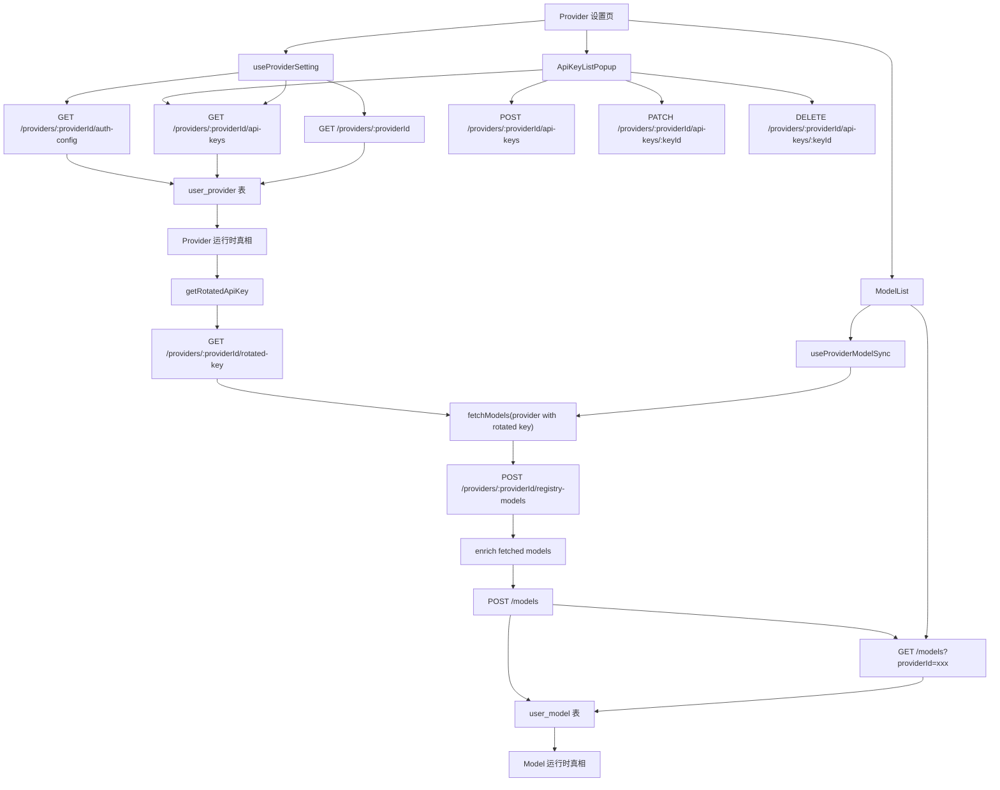
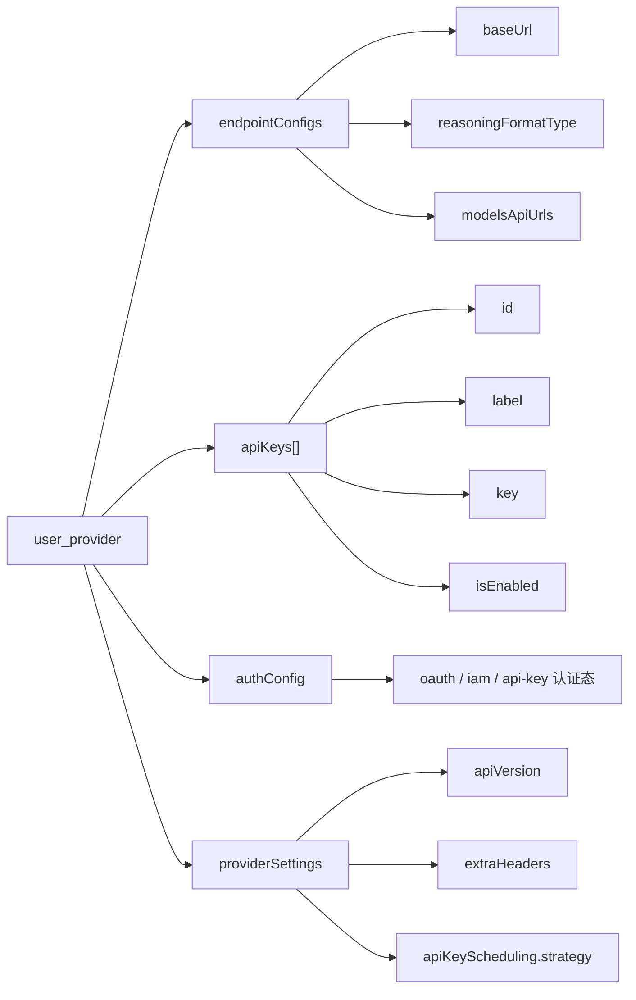
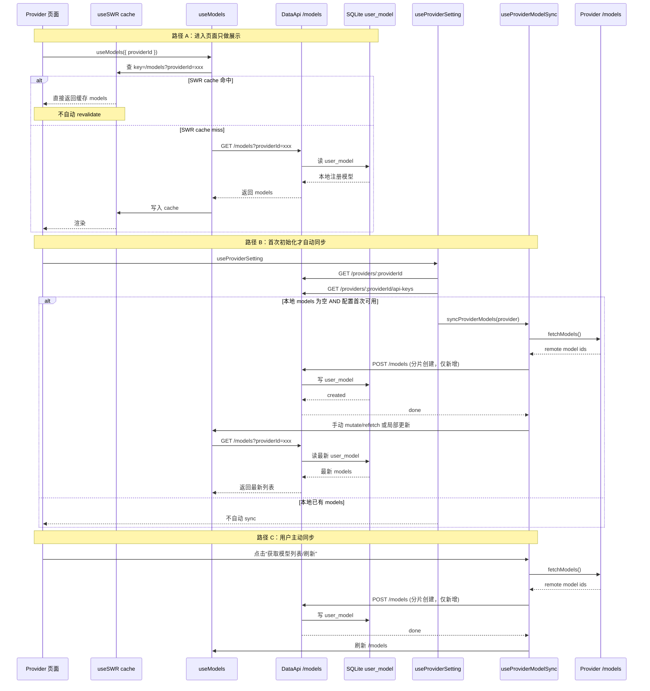

# Provider v2 心智图

> 目的：把 Provider v2 设置页这条链路里最容易混淆的点收成一份可读文档。
>
> 重点回答：
> - `endpointConfigs`、`apiKeys`、`authConfig`、`providerSettings` 各管什么
> - Provider 页面为什么看起来会重复 load
> - “拉取 models” 和 “注册 models” 的边界
> - 哪些数据是真相源，哪些只是运行时派生

---

## 1. 总图



---

## 2. 谁存什么

### 2.1 `user_provider`

`user_provider` 代表“当前用户配置出来的 provider 实例”。

主要字段：

- `providerId`
  Provider 实例 id
- `name`
  展示名
- `endpointConfigs`
  各种 endpoint 的配置
- `apiKeys`
  多 key 列表
- `authConfig`
  OAuth / IAM 等认证态
- `providerSettings`
  其他 provider 级设置
- `isEnabled`
  provider 是否启用

### 2.2 `user_model`

`user_model` 代表“当前 provider 下已经注册到本地的模型”。

主要字段：

- `providerId + modelId`
  模型定位键
- `name / group / description`
  展示信息
- `capabilities / endpointTypes`
  模型能力与调用端点
- `pricing / reasoning`
  enrich 后的元信息
- `isEnabled`
  当前模型是否启用
- `userOverrides`
  用户手动改过的字段保护

---

## 3. Provider 字段分层



可以直接记成五句话：

- **往哪调**：看 `endpointConfigs`
- **怎么认证**：看 `authConfig`
- **拿哪些 key 调**：看 `apiKeys[]`
- **怎么调**：看 `providerSettings`
- **调哪些模型**：看 `user_model`

---

## 4. `endpointConfigs` 为什么不是一个 `apiHost`

Provider v2 不再假设一个 provider 只有一种 endpoint。

一个 provider 可能同时存在：

- `openai-chat-completions`
- `anthropic-messages`
- `openai-responses`
- 其他特殊 endpoint

所以 `endpointConfigs` 必须是：

```ts
provider.endpointConfigs[endpointType] = {
  baseUrl,
  reasoningFormatType,
  modelsApiUrls
}
```

这就是为什么不能只用一个 `apiHost` 字段：

- 不同 endpoint 可能有不同的 base URL
- 不同 endpoint 可能有不同的 reasoning 参数格式
- 不同 endpoint 的 models 拉取地址也可能不同

---

## 5. `authConfig` 和 `apiKeys[]` 的边界

最容易混的就是这两个。

### `authConfig`

存“认证机制本身的状态”：

- OAuth token
- IAM 配置
- api-key 类型的认证元信息

### `apiKeys[]`

存“最终可以被轮询和管理的 key 资产”：

- `id`
- `label`
- `key`
- `isEnabled`

一个 OAuth provider 也可能最终落 key 到 `apiKeys[]`。

所以可以这样理解：

- `authConfig`：怎么认证
- `apiKeys[]`：认证成功后，实际拿什么 key 去调

---

## 6. “拉取 models” 和 “注册 models” 不是一回事

### 拉取 models

指从远端 provider 拉到模型列表。

来源通常是：

- `fetchModels(provider with rotated key)`

它回答的是：

> 远端现在有哪些模型

### 注册 models

指把模型写入本地 `user_model`。

它回答的是：

> 当前这个 provider 下，哪些模型已经进入本地注册表

当前实现里，这两步经常串得很紧：

1. 远端拉模型
2. registry enrich
3. `POST /models`

但从心智上最好还是分开理解：

- fetch：发现
- register：落库

---

## 7. 为什么切换 provider 后像“又重新 load 一遍”

这个问题大概率不是“完全没 cache”，而是：

1. 页面 query 本身是有 DataApi / SWR cache 的
2. 但进入页面后某些 effect 又会触发同步逻辑

所以体感上就变成：

- 列表先有缓存数据
- 然后又因为副作用开始同步
- 看起来像每次都重跑

### 需要分开看的两类操作

#### 读缓存

- `useProvider`
- `useProviderApiKeys`
- `useModels`

#### 副作用同步

- `useProviderModelSync`
- host / endpoint 提交时触发的同步
- 首次 provider 无 models 时的初始化同步

所以你在排查“cache 没生效”时，要先问：

> 是 query 没命中，还是命中后又被同步副作用盖过去了？

---

## 8. 页面进入时的主流程判断

当前更合理的判断应该是：

### 进入 provider 页面

- 先读本地 `user_model`
- 不应该每次进入都自动拉远端 models

### 什么时候自动同步

- provider 当前没有任何 models，且配置首次变得可用
- host / endpoint 等关键配置发生变化

### 什么时候只读本地

- 普通页面切换
- 普通 provider 再次进入
- 普通 key 文本编辑完成后，但没有触发主动同步

---

## 9. 多 Key 管理的真实语义

现在后台真正支持的是：

- `apiKeys[]`
- `isEnabled`
- `getRotatedApiKey()` 的 **round-robin**

所以当前抽屉的真实产品语义应该是：

- 管理 key 资产
- 启停 key
- 健康检查 key
- 系统按轮询使用已启用 key

而不是：

- 真正的随机策略
- 真正的故障转移策略
- 完整的 key 使用统计

如果 UI 要和后台能力对齐，应该把抽屉理解为：

> 多 Key 资产管理 + 轮询说明

---

## 10. 一句总纲

如果只记一句话，记这个：

> Provider v2 里，`user_provider` 负责“配置 provider 怎么调”，`user_model` 负责“这个 provider 下有哪些模型已注册”，而页面反复 load 的体感，通常来自“读缓存 + 同步副作用”同时存在。

---

## 11. 进入 Provider 的最终时序图



---

## 12. 为什么再次进入 Provider 会看到 `/models`

要把三类原因分开看：

### 12.1 SWR remount 后自动 revalidate

`useModels()` 底层走的是 `useQuery('/models')`，而 `useQuery()` 又直接基于 `useSWR(...)`。

当前默认配置见：

- `src/renderer/src/data/hooks/useDataApi.ts`
- `DEFAULT_SWR_OPTIONS`

```ts
const DEFAULT_SWR_OPTIONS = {
  revalidateOnFocus: false,
  revalidateOnReconnect: true,
  dedupingInterval: 5000
}
```

这意味着：

- 不是窗口 focus 导致的重拉
- 但 mount stale revalidate 仍可能发生
- 所以“有 cache 但又发了一次 `/models`”并不矛盾

### 12.2 `dedupingInterval` 已过期

`dedupingInterval: 5000` 只是抑制短时间内同 key 的重复请求，不代表页面再次进入永远不发请求。

可以这样验证：

- 5 秒内切出去再回来
- 6 秒后再回来

如果前者不发、后者发，就说明是 dedupe 窗口过期后的正常请求。

### 12.3 自动同步或 mutation refresh 触发第二次 `/models`

这类原因通常会伴随下面的链路：

1. `GET /models`
2. `GET /providers/:providerId/rotated-key`
3. `POST /providers/:providerId/registry-models`
4. `POST /models`
5. 再次 `GET /models`

其中第二次 `/models` 的关键触发点在：

- `src/renderer/src/hooks/useModels.ts`

```ts
useMutation('POST', '/models', {
  refresh: ['/models']
})
```

也就是：

- 同步创建成功
- 自动 refresh `/models`
- 再次 revalidate

所以看起来像“缓存没生效”，但真实情况更接近：

> 先读了 cache / 本地注册表，又被同步副作用触发了一次刷新。

---

## 13. 如果后续要优化，应该改哪里

如果要把“进入 provider 页面”改成真正的“优先展示 cache，不默认重复请求”，需要重点改这几个文件：

### 13.1 `src/renderer/src/data/hooks/useDataApi.ts`

这里控制 `useQuery()` 底层 SWR 默认行为。

关注点：

- `revalidateOnMount`
- `revalidateIfStale`
- 是否允许 `useModels()` 单独覆盖 SWR 策略

### 13.2 `src/renderer/src/hooks/useModels.ts`

这里是 `/models` 查询的统一入口。

关注点：

- 是否为 `useModels()` 增加更明确的 cache-first 策略
- 是否允许 provider 设置页传入“仅展示，不自动 revalidate”的模式

### 13.3 `src/renderer/src/pages/settings/ProviderSettings/hooks/useProviderSetting.ts`

这里是“自动同步判定器”。

当前关键点：

- 本地 `models.length === 0` 且配置首次可用时自动 sync
- host / endpoint 提交时也会主动调用 `syncProviderModels(...)`

如果后续要进一步收紧自动同步，这里是第一改点。

### 13.4 `src/renderer/src/pages/settings/ProviderSettings/hooks/useProviderModelSync.ts`

这里是“同步执行器”。

当前职责：

- 拉远端模型
- 过滤已有模型
- 分片 `POST /models`

如果后续想把“自动同步”和“用户主动同步”彻底拆开，这里也会调整。

### 13.5 `src/renderer/src/pages/settings/ProviderSettings/ModelList/modelSync.ts`

这里还挂着一个明确的后续优化点：

> 在创建链路里，先调用 `POST /providers/:providerId/registry-models` 再 `POST /models` 是冗余的。

因为 `POST /models` 后端本身就会再做一次 registry enrich。

所以后续若优化同步链，这个文件会是核心改动点。
